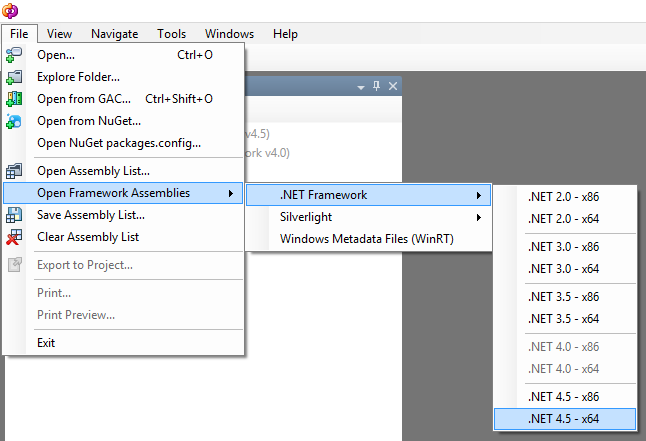

# dotpeek-peekfx

PeekFx allows loading and decompilation of groups of .NET framework assemblies in dotPeek. It supports dotPeek 1.0 and 1.1.

## What does it do? ##

The plugin adds a new menu item under dotPeek's File menu:

+ Open Framework Assemblies

This menu item allows loading framework assemblies for:

* .NET 2.0
* .NET 3.0
* .NET 3.5
* .NET 4.0
* .NET 4.5
* Silverlight 3
* Silverlight 4
* Silverlight 5
* Windows Metadata Files (WinRT)

## How do I get it? ##

If you wish to just install a copy of the plugins without building yourself:

- Download the latest zip file: [PeekFx-1.0.zip](https://github.com/JetBrains/dotpeek-PeekFx/raw/downloads/downloads/PeekFx-1.0.zip)
- Extract everything
- Run the appropriate batch file for your version of dotPeek, e.g. Install-PeekFx.1.0.bat for dotPeek 1.0, or Install-PeekFx.1.1.bat for dotPeek 1.1, or Install-PeekFx.1.1.bat for dotPeek 1.2.

## Building ##

To build the source, you need the [ReSharper SDK](http://www.jetbrains.com/resharper/download/index.html) installed .

The build.bat file in this repository builds the plugin from scratch. Note that a folder _external_ containing subdirectories _v1.0_ and _v1.1_ must be created and dotPeek assembly files copied in to create the build.

If you only wish to target a specific version of dotPeek, open the appropriate solution file from the repository.

## Contributing ##

Feel free to [raise issues on GitHub](https://github.com/JetBrains/dotpeek-PeekFx/issues), or [fork the project](http://help.github.com/fork-a-repo/) and [send a pull request](http://help.github.com/send-pull-requests/).

